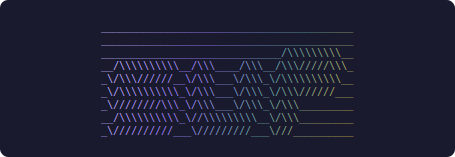
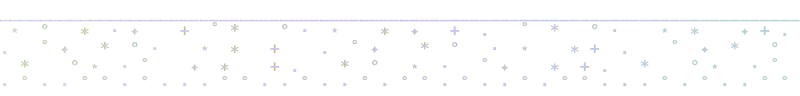
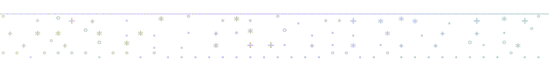

<!-- add signature.svg to ./assets/ -->

# sup

single command that updates every package manager and dev tool on your system.


[what it does](#what-it-does) | [install](#install) | [usage](#usage) | [what's inside](#whats-inside)

<br>
<br>


<br>
<br>

## what it does

sup detects every package manager and developer tool on your machine and updates them all. one command. no config files. no dependencies beyond bash 4.

built this because running `brew update && brew upgrade && rustup update && npm update -g && pipx upgrade-all && ...` every morning was getting old. 49 tools. one word.

<br>
<br>



<br>
<br>

## install

```bash
curl -fsSL https://raw.githubusercontent.com/zaydiscold/sup/main/install.sh | bash
```

or

```bash
brew install zaydiscold/tap/sup     # homebrew
```

or

```bash
npm install -g @zaydiscold/sup      # npm
```

or

```bash
curl -fsSL -o sup.sh https://github.com/zaydiscold/sup/releases/latest/download/sup.sh
chmod +x sup.sh
mv sup.sh ~/.local/bin/sup          # direct download
```

or

```bash
git clone https://github.com/zaydiscold/sup
```

note: requires bash 4+. macos ships 3.2 by default. run `brew install bash` first if you're on a mac.

<br>
<br>


<br>
<br>

## usage

```
sup                              # detect + confirm + update everything
sup --list                       # show all 49 supported tools
sup --dry-run                    # show what would run, change nothing
sup --interactive                # TUI picker (gum > fzf > builtin)
sup --only claude --only uv      # just these two
sup --skip homebrew              # everything except homebrew
sup --yes                        # skip confirmation (scripts/ci)
sup --self-update                # update sup itself (checksum verified)
sup --verbose                    # show commands as they run
sup config                       # preferences menu (numbered, not TUI)
```

`--skip` and `--only` are repeatable. `--skip` wins if both target the same tool. `--dry-run` overrides `--yes`.

`--interactive` opens a selector where you pick which tools to update. if `gum` is installed it uses `gum choose --no-limit`. otherwise falls back to `fzf --multi`. if neither is installed it drops to a pure bash arrow-key selector with space-to-toggle.

`sup config` is a numbered menu (type 1-7, press enter). lets you toggle cleanup behavior, homebrew greedy casks, auto-retry, skip lists. preferences save to `~/.config/sup/preferences`.

| exit code | meaning |
|-----------|---------|
| 0 | all good (or nothing to update) |
| 1 | one or more tools failed |
| 3 | bash too old |
| 130 | ctrl+c |

<br>
<br>



<br>
<br>

## what's inside


single file. ~1700 lines. no external dependencies. works on macos and linux.

**49 tools across 8 tiers:**

- **system** // homebrew, homebrew casks, apt, snap, flatpak, mac app store, macos system updates
- **languages** // rustup, uv, pipx, conda, mamba, pyenv, asdf, mise
- **node** // npm globals, pnpm, bun, deno
- **ai tools** // claude code, gemini cli, ollama, goose, amazon q, aider, open interpreter, huggingface cli, github copilot, codex cli
- **dev clis** // github extensions, vercel, firebase, supabase, railway, fly.io, wrangler, gcloud, terraform
- **editors** // vs code extensions, vs code insiders, vscodium
- **shell** // oh-my-zsh, oh-my-bash, fisher, tmux plugins
- **other** // rubygems, composer, cargo crates, go binaries

each tool gets auto-detected, run with a timeout, auto-retried on transient failures, and classified on error. failures don't block other tools. the summary tells you what to fix manually.

self-update downloads from github releases and verifies sha-256 checksums before replacing the binary. if sup was installed via homebrew it redirects you to `brew upgrade sup`.

<br>
<br>


<br>
<br>

[](https://star-history.com/#zaydiscold/sup&Date)

mit. [license](./LICENSE)

<br>
<br>


<br>
<br>


<sub>

- [x] --interactive tui
- [ ] go rewrite
- [ ] --json output
- [ ] ollama model updates
- [ ] docker image updates

</sub>
